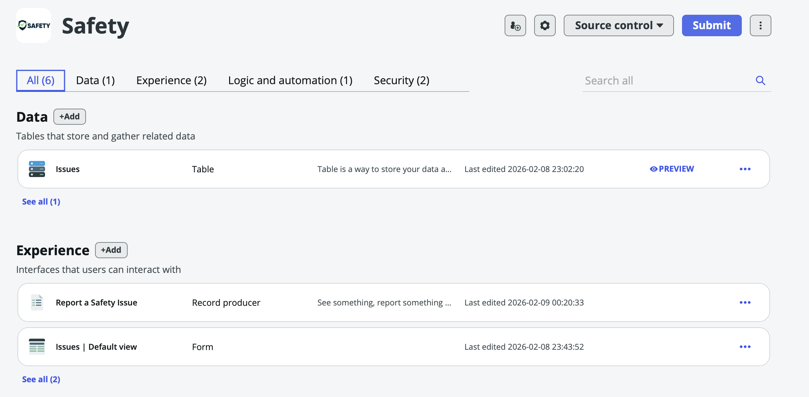
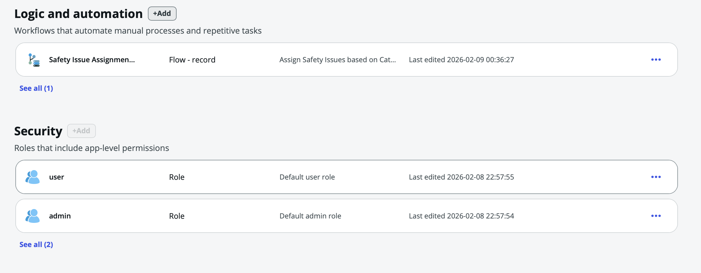
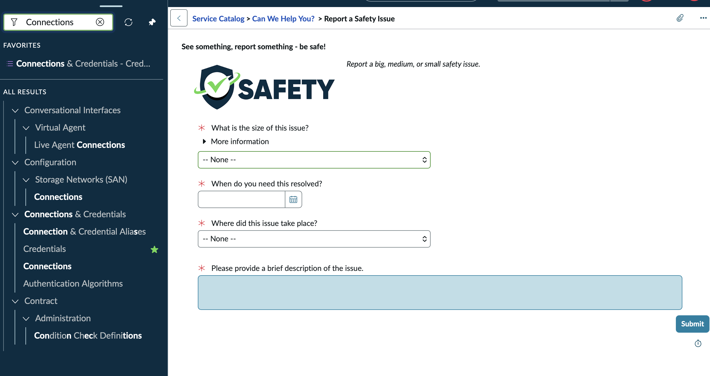
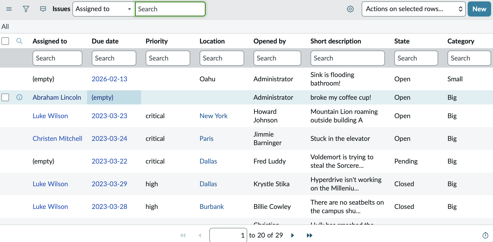
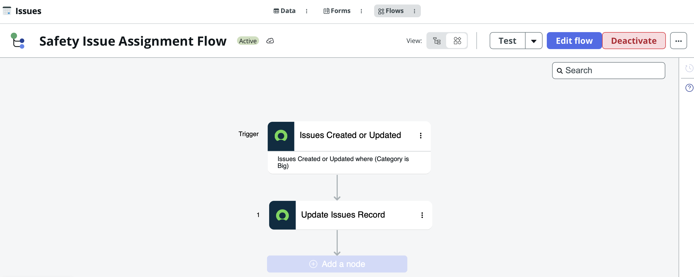

# Safety Issues Management App

> A ServiceNow application for reporting and tracking safety issues, built following the **ServiceNow University Associate Application Developer Path** (Intro to App Engine Studio for Developers).

## 🎯 Project Overview

This application provides a complete solution for reporting and tracking safety issues within an organization. Built using **App Engine Studio**, it demonstrates core ServiceNow development competencies.

**Platform:** ServiceNow  
**Development Tool:** App Engine Studio  
**Training Path:** ServiceNow University - Associate Application Developer

---

## 📸 Screenshots

### App Overview - All Components

### Service Catalog - Report a Safety Issue
Users submit safety issues through this guided form in the Service Catalog.

### Issues List View
All submitted issues are tracked in this list view with filtering and sorting capabilities.

### Flow Designer - Issue Assignment Automation
When a "Big" category issue is created, the flow automatically triggers to update and assign the record.

---

## 💼 Skills Demonstrated

| Skill Area | Implementation |
|------------|----------------|
| **Data Modeling** | Custom Issues table with appropriate field types and relationships |
| **Workflow Automation** | Flow Designer for automated issue assignment |
| **User Experience** | Service Catalog item with guided form submission |
| **Security** | Role-based access control with user and admin roles |
| **Source Control** | GitHub integration for version control |

---

## 🏗️ Application Components

### Data (1)
- **Issues Table** (`x_1914952_safety_issues`)
  - Size/Priority classification
  - Resolution target date
  - Location tracking
  - Issue description
  - State management

### Experience (2)
- **Service Catalog Item** - "Report a Safety Issue"
  - Custom branding with Safety logo
  - Guided form with required field validation
  - Category: "Can We Help You?"
  
### Logic & Automation (1)
- **Safety Issue Assignment Flow**
  - Trigger: Issues Created or Updated (where Category is Big)
  - Action: Update Issues Record (auto-assignment)

### Security (2)
- **user** - Default user role for submitting and viewing issues
- **admin** - Administrative access for managing all issues

---

## 📋 Service Catalog Form

The "Report a Safety Issue" catalog item includes:

| Field | Type | Required |
|-------|------|----------|
| What is the size of this issue? | Choice | ✅ |
| When do you need this resolved? | Date | ✅ |
| Where did this issue take place? | Choice | ✅ |
| Brief description of the issue | Text | ✅ |

*"See something, report something - be safe!"*

---

## 🔄 How It Works

1. **User submits** a safety issue through the Service Catalog
2. **Record is created** in the Issues table with auto-generated number
3. **Flow triggers** if the category is "Big"
4. **Issue is assigned** automatically based on flow logic
5. **Admins manage** issues through the list view, updating state as resolved

---

## 🛠️ Technologies Used

- App Engine Studio (AES)
- Flow Designer
- Service Catalog
- Data Tables & Forms
- Access Control Lists (ACLs)
- Source Control Integration (GitHub)

---

## 📚 Training & Certification Path

This application was built as part of the **ServiceNow University Associate Application Developer** learning path, which covers:

- Introduction to App Engine Studio
- Building custom applications
- Data modeling and table design
- Workflow automation with Flow Designer
- Service Catalog configuration
- Security and access control

---

## 🔗 Repository Details

| Property | Value |
|----------|-------|
| **App Name** | Safety |
| **Scope** | `x_1914952_safety` |
| **Version** | 1.0.0 |

---

## 👨‍💻 About

This project demonstrates hands-on experience with ServiceNow development through completing the official ServiceNow University training curriculum. It showcases:

- ✅ Understanding of the ServiceNow platform
- ✅ Ability to build applications using App Engine Studio
- ✅ Knowledge of development best practices
- ✅ Commitment to professional development through official training

---

*Built on a ServiceNow Personal Developer Instance (PDI)*
